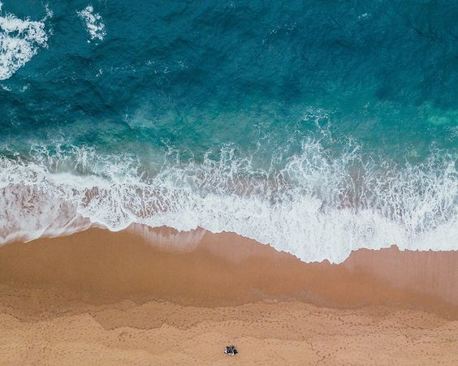
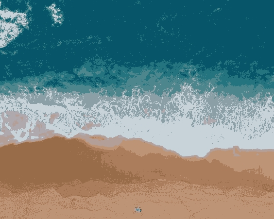

# KMeans Clustering with Image Upload and Feature Extraction

This repository contains a KMeans clustering implementation that clusters uploaded images based on color, texture, and spatial features. The application uses **Streamlit** for the web interface, and the **KMeans** algorithm is implemented manually. Users can upload images, select the number of clusters, and visualize the clustering results. You can try out the live version of the KMeans Clustering app deployed on Streamlit Cloud at the following link:

K-Means Clustering App [https://k-meansclustering-sda2rjqpi8mqcghkkzlvqz.streamlit.app/]

In this app, you can upload images, choose the number of clusters, and visualize the clustering results with mean colors for each cluster.

**Before Clustering**:


**After Clustering**:



## Features

- **Upload Multiple Images**: Supports PNG, JPG, and JPEG formats.
- **Dynamic Clustering**: Select the number of clusters (K) from 2 to 10.
- **Feature Extraction**:
  - Color features: Extracted from HSV (Hue, Saturation, Value) channels.
  - Texture features: Extracted using Laplacian filter to detect edges.
  - Spatial features: Derived from image moments.
- **Normalization**: Non-color features are normalized using Min-Max scaling.
- **Clustering**: Custom implementation of KMeans, including centroid initialization, cluster assignment, and centroid updates.
- **Silhouette Score**: Displays the Silhouette Score to evaluate clustering quality.
- **Cluster Visualization**: Outputs the clustered image with mean cluster colors and provides color swatches for each cluster.

## Requirements

To install the required dependencies, run:

```bash
pip install streamlit opencv-python numpy scikit-learn Pillow


